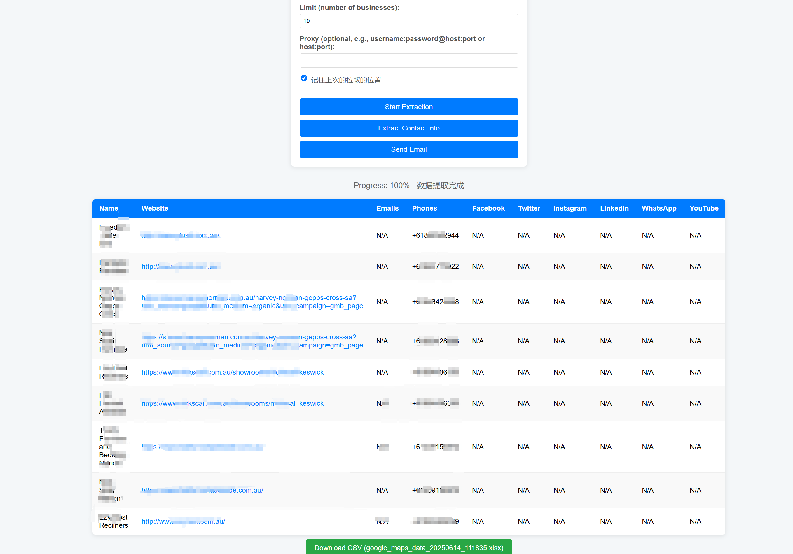
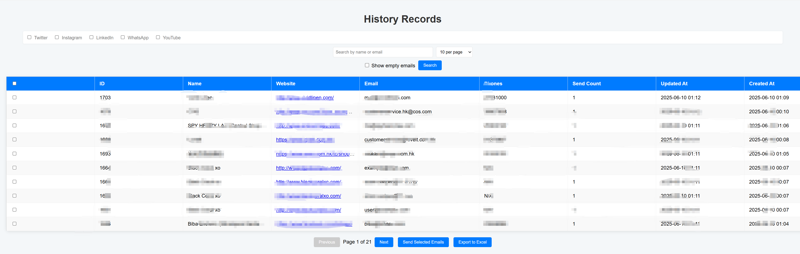
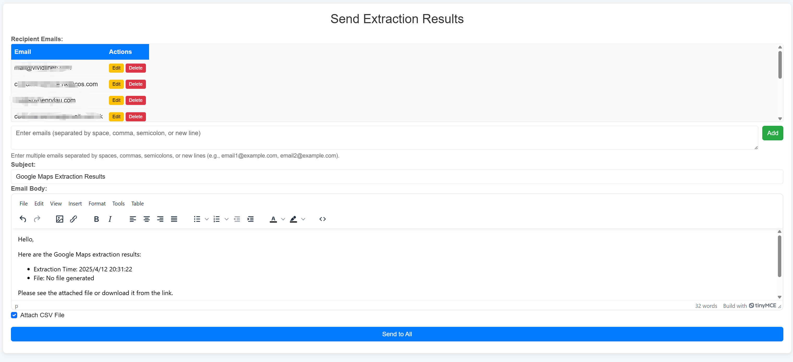

# Google Maps 项目

## 项目概述

`google_maps` 是一个开源项目，利用 Google Maps  提供商家信息提取功能。通过模拟用户点击，项目从 Google Maps 搜索结果（例如 `https://www.google.com/maps/search/recliner/@-34.9252049,138.5057693,12z`）提取商家数据，包括网站地址、联系方式（电话、邮箱等）以及社交媒体信息（如 Twitter、Facebook）。提取的数据存储到后台，并支持通过邮件功能（`EmailSender` 类）发送通知。项目已清理敏感信息，托管于 [GitHub](https://github.com/wvqkhn/google_maps)。

## 默认登录凭据

- **用户名**：`admin`
- **密码**：`admin`

**注意**：为安全起见，建议在生产环境中更改默认凭据。

## 功能介绍

项目支持以下主要功能：

- **商家信息提取**：
  - 通过提供 Google Maps URL（例如 `https://www.google.com/maps/search/recliner/@-34.9252049,138.5057693,12z`），提取商家名称、网站、电话、邮箱等信息。
  - 支持设置提取商家数量（默认 10 个）。
  - 
- **联系方式扩展**：
  - 点击“Extract Contact Info”进一步获取 Twitter、Facebook、Instagram、LinkedIn、WhatsApp 和 YouTube 等社交媒体信息。
  - 
- **邮件通知**：
  - 提取完成后，点击“Send Email”将结果通过邮件发送（使用 `EmailSender` 类）。
  - 



## 安装和配置

### 环境要求
- Python 3.6+
- MySQL 数据库
- CHROME 和对应的  CHROME Driver
- 邮件服务（如 Gmail）用于 `EmailSender`

### 安装步骤
1. 克隆仓库：
   ```bash
   git clone git@github.com:wvqkhn/google_maps.git
   cd google_maps